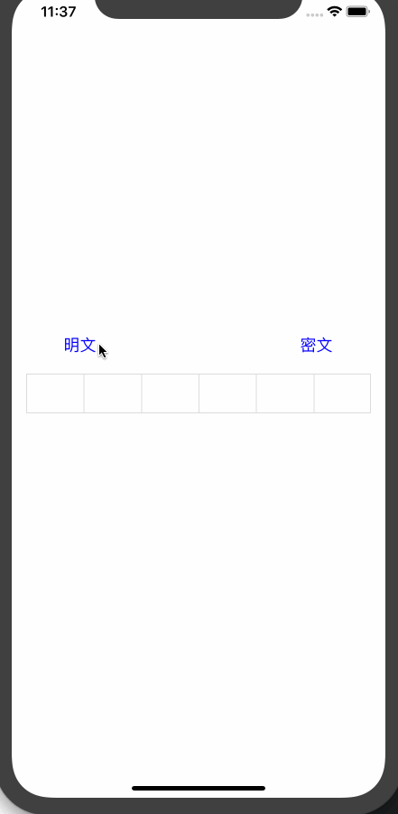

#类似于微信支付宝密码输入框，支持动态设置支付密码位数，默认是6位支付密码

1-> 支持cocoapods拉取库 使用: pod 'HBPayPassWordView'

   
```  #设置下面这些相关属性可以实现对应的需求

    ///支付密码长度位数默认为6位
    var inputPwdNumber: Int = 6
    
     ///输入密码字体颜色和大小
    var inputPwdColorOrFont: (UIColor, CGFloat) = (UIColor(0x4A4A4A), 14)

     ///是否禁用键盘输入
    var isCanBeInputPwd: Bool = true
    
    ///默认密文显示
    var inputPwdIsClipherText: Bool = true
```

2-> 支持block回调实时获取输入的支付密码
 ```
  payPwdView.payPassWordHandler = { [weak self] passwd in
            print("passWord = \(passwd)")
            if passwd.count == 6 {
                
            }
        }
  ```

3-> 效果图：



